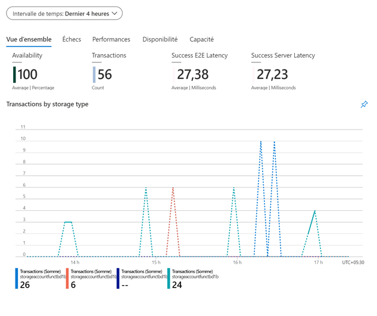

---
wts:
    title: '04: Creación de almacenamiento de blobs'
    module: 'Módulo 02: Servicios principales de Azure'
---
# 04 - Crear almacenamiento de blobs

En este tutorial, crearemos una cuenta de almacenamiento y luego trabajaremos con archivos de almacenamiento de blobs.

# Tarea 1: Crear una cuenta de almacenamiento

En esta tarea crearemos una nueva cuenta de almacenamiento. 

1. Inicie sesión en Azure Portal en <a href="https://portal.azure.com" target="_blank">https://portal.azure.com</a>

2. Desde la hoja **Todos los servicios**, busque y seleccione **Cuentas de almacenamiento** y luego haga clic en **+ Agregar**. 

3. En la pestaña **Datos básicos** de la hoja **Crear cuenta de almacenamiento**, complete la siguiente información (reemplace **xxxx** en el nombre de la cuenta de almacenamiento con letras y dígitos de modo que el nombre sea globalmente único). Deje los valores predeterminados para todo lo demás.

    | Configuración | Valor | 
    | --- | --- |
    | Suscripción | **Elija su suscripción** |
    | Grupo de recursos | **myRGStorage** (crear nuevo) |
    | Nombre de la cuenta de almacenamiento | **storageaccountxxxx** |
    | Ubicación | **Este de EE. UU.**  |
    | Rendimiento | **Estándar** |
    | Variante de cuenta | **Almacenamiento V2 (uso general v2)** |
    | Replicación | **Almacenamiento con redundancia local (LRS)** |
    | Nivel de acceso (predeterminado) | **Frecuente** |
    | | |

5. Haga clic en **Revisar + Crear** para revisar la configuración de su cuenta de almacenamiento y permitir que Azure valide la configuración. 

6. Una vez validada, haga clic en **Crear**. Espere la notificación de que la cuenta se creó correctamente. 

7. Desde la página de inicio, busque y seleccione **Cuentas de almacenamiento** y asegúrese de que su nueva cuenta de almacenamiento aparezca en la lista.

    

# Tarea 2: Trabaje con almacenamiento de blobs

En esta tarea, crearemos un contenedor de blobs y subiremos un archivo de blobs. 

1. Haga clic en el nombre de la nueva cuenta de almacenamiento, desplácese hasta la sección **Blob service** y luego haga clic **Contenedores**.

2. Haga clic en **+ Contenedor** y complete la información. Use los iconos de información para obtener más información. Cuando termine, haga clic en **Aceptar**.

    | Valor | Valor |
    | --- | --- |
    | Nombre | **contenedor1**  |
    | Nivel de acceso público| **Privado (sin acceso anónimo)** |
    | | |

    

4. Haga clic en el contenedor **contenedor1** y luego en **Cargar**.

5. Busque un archivo en su computadora local. 

    **Nota**: Puede crear un archivo `.txt` vacío o usar cualquier archivo existente. Considere elegir un archivo de tamaño pequeño para minimizar el tiempo de carga.

6. Haga clic en la flecha **Avanzado**, deje los valores predeterminados pero revise las opciones disponibles y luego haga clic en **Cargar**.

    **Nota**: Puede cargar tantos blobs como quiera de esta manera. Los nuevos blobs se enumerarán dentro del contenedor.

7. Una vez que se carga el archivo, haga clic con el botón derecho en el archivo y observe las opciones que incluyen Ver/editar, Descargar, Propiedades y Eliminar. 

8. A medida que tenga tiempo, desde la hoja de la cuenta de almacenamiento, revise las opciones para Archivos, Tablas y Colas.

# Tarea 3: Supervisar la cuenta de almacenamiento

1. Si es necesario, regrese a la hoja de la cuenta de almacenamiento y haga clic en **Diagnosticar y resolver problemas**. 

2. Explore algunos de los problemas de almacenamiento más comunes. Tenga en cuenta que hay múltiples solucionadores de problemas.

3. En la hoja de la cuenta de almacenamiento, desplácese hacia abajo hasta la sección **Supervisión** y haga clic en **Información (vista previa)**. Observe que hay información sobre Fallas, Rendimiento, Disponibilidad y Capacidad. Su información será diferente.

    

¡Enhorabuena! Creó una cuenta de almacenamiento y luego trabajó con blobs de almacenamiento.

**Nota**: Para evitar costes adicionales, puede eliminar este grupo de recursos. Busque grupos de recursos, haga clic en su grupo de recursos y, a continuación, haga clic en **Eliminar grupo de recursos**. Compruebe el nombre del grupo de recursos y luego haga clic en **Eliminar**. Supervise las **Notificaciones** para ver cómo se realiza la eliminación.
