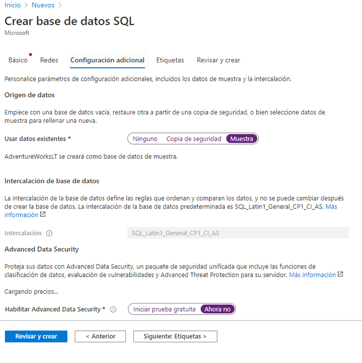

---
wts:
    title: '06 - Crear una base de datos SQL (5 minutos)'
    module: 'Módulo 2 - Servicios principales de Azure (Cargas de trabajo)'
---

# 06: Crear una base de datos de SQL (5 min)

En este tutorial, crearemos una base de datos SQL en Azure y luego consultaremos los datos en esa base de datos.

# Tarea 1: Crear la base de datos 

En esta tarea, crearemos una base de datos SQL según la base de datos de muestra AdventureWorksLT. 

1. Inicie sesión en Azure Portal a través de [**https://portal.azure.com**](https://portal.azure.com).

2. En la hoja **Todos los servicios**, busque y seleccione **Bases de datos SQL** y luego haga clic en **+ Agregar, + Crear y + Nueva**. 

3. En la pestaña **Datos básicos**, rellene esta información.  

    | Configuración | Valor | 
    | --- | --- |
    | Suscripción | **Utilice la suscripción predeterminada suministrada** |
    | Grupo de recursos | **Crear un nuevo grupo de recursos** |
    | Nombre de la base de datos| **db1** | 
    | Servidor | Seleccione **Crear nuevo** (se abrirá una nueva barra lateral a la derecha)|
    | Nombre del servidor | **sqlserverxxxx** (debe ser único) | 
    | Inicio de sesión del administrador del servidor | **sqluser** |
    | Contraseña | **Pa$$w0rd1234** |
    | Ubicación | **(EE. UU.) Este de EE. UU.** |
    | Haga clic en  | **Aceptar** |

   

4. En la pestaña **Redes**, configure las siguientes opciones (deje el resto con los valores predeterminados). 

    | Configuración | Valor | 
    | --- | --- |
    | Método de conectividad | **Punto de conexión público** |    
    | Permitir que los servicios y recursos de Azure accedan a este servidor | **Sí** |
    | Agregar la dirección IP actual del cliente | **No** |
    
   

5. Haga clic en la pestaña **Seguridad**. 

    | Configuración | Valor | 
    | --- | --- |
    | Azure Defender para SQL| **Ahora no** |
    
6. Vaya a la pestaña **Configuración adicional**. Utilizaremos la base de datos de muestra AdventureWorksLT.

    | Configuración | Valor | 
    | --- | --- |
    | Use datos existentes | **Muestra** |

    

7. Haga clic en **Revisar y crear** y, a continuación, en **Crear** para implementar y aprovisionar el grupo de recursos, el servidor y la base de datos. La implementación puede tardar de 2 a 5 minutos.


# Tarea 2: Pruebe la base de datos.

En esta tarea, configuraremos el servidor SQL y ejecutaremos una consulta SQL. 

1. Cuando la implementación se haya completado, haga clic en Ir al recurso desde la hoja de implementación. Como alternativa, busque y seleccione **Bases de datos** y luego **Bases de datos SQL** en la hoja **Todos los recursos** y asegúrese de que se ha creado su nueva base de datos. Es posible que necesite **Actualizar** la página.

    

2. Haga clic en la entrada **db1** que representa la base de datos SQL que ha creado. En la hoja db1, haga clic en **Editor de consultas (versión preliminar)**.

3. Inicie la sesión como **sqluser** con la contraseña **Pa$$w0rd1234**.

4. No podrá iniciar la sesión. Lea el error con atención y tome nota de la dirección IP que debe permitirse a través del firewall. 

    

5. Vuelva a la hoja **db1** y haga clic en **Información general**. 

    

6. En la hoja **Información general** de db1, haga clic en **Establecer el firewall del servidor** que aparece en la parte superior central de la pantalla Información general.

7. Haga clic en **+ Agregar IP de cliente** (en la barra de menús de la parte superior) para agregar la dirección IP a la que hacía referencia el error (es posible que los campos se hayan autorellenado por usted; en caso contrario, péguela en los campos de la dirección IP). Asegúrese de **guardar** los cambios. 

    

8. Vuelva a su base de datos de SQL (deslice la barra de alternancia hacia la izquierda) y haga clic en **Editor de consultas (versión preliminar)**. Intente iniciar sesión de nuevo como **sqluser** con la contraseña **Pa$$w0rd1234**. Esta vez debería poder hacerlo. Tenga en cuenta que la implementación de la nueva regla de firewall puede tardar un par de minutos. 

9. Una vez que ha iniciado sesión correctamente, aparece el panel de consultas. Escriba la consulta siguiente en el panel del editor. 

    ```SQL
    SELECT TOP 20 pc.Name as CategoryName, p.name as ProductName
    FROM SalesLT.ProductCategory pc
    JOIN SalesLT.Product p
    ON pc.productcategoryid = p.productcategoryid;
    ```

    

10. Haga clic en **Ejecutar** y, luego, revise los resultados de la consulta en el panel **Resultados**. La consulta debería ejecutarse correctamente.

    

¡Enhorabuena! Ha creado una base de datos SQL en Azure y ha consultado con éxito los datos en esa base de datos.

**Nota**: Para evitar costes adicionales, puede quitar este grupo de recursos. Busque grupos de recursos, haga clic en su grupo de recursos y, a continuación, haga clic en **Eliminar grupo de recursos**. Compruebe el nombre del grupo de recursos y luego haga clic en **Eliminar**. Supervise las **Notificaciones** para ver cómo se realiza la eliminación.
