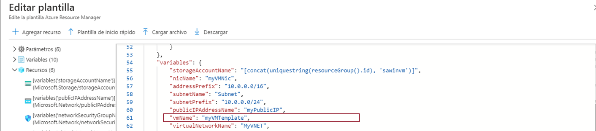

---
wts:
    title: '09 - Crear una máquina virtual con una plantilla (10 minutos)'
    module: 'Módulo 3: Describir las soluciones principales y las herramientas de administración'
---
# 09: Crear una máquina virtual con una plantilla (10 min)

En este tutorial implementaremos una máquina virtual con una plantilla de inicio rápido y examinaremos las funcionalidades de supervisión.

# Tarea 1: Explorar la galería de inicio rápido y localizar una plantilla 

En esta tarea, examinaremos la galería de inicio rápido de Azure e implementaremos una plantilla que crea una máquina virtual. 

1. En el ambiente del laboratorio, abra una nueva ventana en el explorador y escriba T https://azure.microsoft.com/es-es/resources/templates/?azure-portal=true. En la galería encontrará una serie de plantillas populares y recientemente actualizadas. Estas plantillas automatizan la implementación de los recursos de Azure, incluida la instalación de paquetes de software populares. Explore los diferentes tipos de plantillas disponibles.

3. Seleccione **Implementar una VM de Windows sencilla**.

4. Haga clic en el botón **Implementar en Azure**. Su sesión del explorador se redirigirá automáticamente a [Azure Portal](http://portal.azure.com/).

  **Nota**: El botón **Implementar en Azure** le permite implementar la plantilla a través de Azure Portal. Durante dicha implementación, se le pedirá confirmación solo de un pequeño conjunto de parámetros de configuración. 

5. Cuando se le solicite, inicie sesión en su suscripción de Azure.

6. En la hoja **Implementación personalizada**, haga clic en **Editar plantilla**. El formato de la plantilla Administrador de recursos usa el formato JSON. Revise los parámetros y variables.  A continuación, busque el parámetro para el nombre de la máquina virtual. Cambie el nombre a **myVMTemplate**. Seleccione **Guardar** para guardar los cambios. Regresa a la hoja **Implementación personalizada** en el Azure Portal.

    

7. En la hoja **Implementación personalizada**, configure los parámetros requeridos por la plantilla (reemplace ***xxxx*** en el prefijo de la etiqueta DNS con letras y dígitos de modo que la etiqueta sea globalmente única). Deje los valores predeterminados para todo lo demás. 

    | Configuración| Valor|
    |----|----|
    | Suscripción | **Deje la suscripción predeterminada suministrada**|
    | Grupo de recursos | **Crear un nuevo grupo de recursos** |
    | Región | Deje la opción predeterminada |
    | Nombre de usuario del administrador | **azureuser** |
    | Contraseña del administrador | **Pa$$w0rd1234** |
    | Prefijo de etiqueta DNS | **miplantillavmxxxx** |
    | Versión del SO | **2019-Centro de datos** |

9. Haga clic en **Revisar y crear**.

10. Supervise su implementación. 

# Tarea 2: Comprobar la máquina virtual y hacer un seguimiento de ella

En esta tarea, comprobaremos que la máquina virtual se implementó correctamente. 

1. Desde la hoja **Todos los servicios**, busque y seleccione **Maquinas virtuales**.

2. Asegúrese de que se haya creado su nueva máquina virtual. 

    

3. Seleccione su máquina virtual y, en el panel **Información general**, seleccione la pestaña **Supervisión** y desplácese hacia abajo para ver los datos de supervisión.

    **Nota**: El plazo de supervisión se puede ajustar de una hora a 30 días.

4. Revise los diferentes cuadros que se proporcionan, incluidos **CPU (promedio)**, **Red (total)**y **Bytes de disco (total)**. 

    

5. Haga clic en cualquier gráfico. Tenga en cuenta que puede seleccionar **Agregar métrica** y cambiar el tipo de gráfico.

6. Vuelva a la hoja **Visión general**. (Deslice la barra de alternancia hacia la izquierda).
7. Haga clic en el **Registro de actividad** (panel izquierdo). Los registros de actividad registran eventos tales como la creación o modificación de recursos. 

8. Haga clic en **Agregar filtro** y experimente con la búsqueda de diferentes tipos de eventos y operaciones. 

    

¡Enhorabuena! Ha creado correctamente un recurso a partir de una plantilla y la ha implementado en Azure.

**Nota**: Para evitar costes adicionales, puede quitar este grupo de recursos. Busque grupos de recursos, haga clic en su grupo de recursos y, a continuación, haga clic en **Eliminar grupo de recursos**. Compruebe el nombre del grupo de recursos y luego haga clic en **Eliminar**. Supervise las **Notificaciones** para ver cómo se realiza la eliminación.
