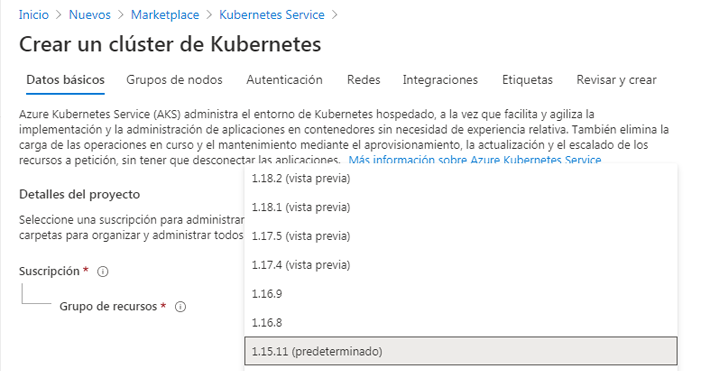
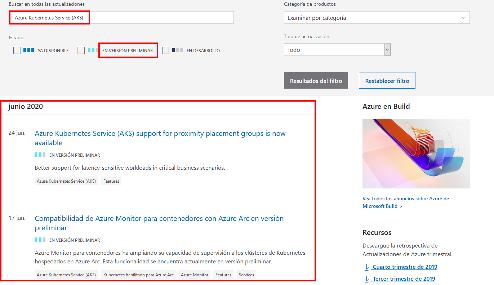

---
wts:
    title: '23: Acceso a las funciones de Vista previa de Azure'
    module: 'Módulo 4: precios y soporte técnico de Azure'
---

# 23 - Acceda a las funciones de Vista previa de Azure

En este tutorial accederemos e identificaremos los servicios y características de vista previa de Azure, y veremos información sobre las últimas actualizaciones de Azure.

# Tarea 1: Acceso a servicios y características de vista previa

En esta tarea revisaremos las funciones de vista previa de Marketplace. 

1. Inicie sesión en [Azure Portal](https://portal.azure.com).

2. Desde la hoja **Todos los servicios**, busque y seleccione **Marketplace**. 

3. Busque en el marketplace para obtener una **Vista previa**. Revise cualquier producto de vista previa que le interese. 

4. Busque en el Marketplace para ver el **Kubernetes Service**. Seleccione el Kubernetes Service, y haga clic en **Crear**.

5. En el aviso desplegable de la **Versión Kubernetes** hay una versión de **Vista previa**. No todos los servicios tendrán una versión en vista previa. 

    

    **Nota**: En estos escenarios, donde se ponen a disposición nuevas funciones o características dentro de un servicio o producto de Azure generalmente disponible, aunque es posible que esté utilizando el servicio de Azure en producción, es posible que la característica o funcionalidad de vista previa aún no esté lista para implementaciones de producción. Debe asegurarse de conocer todas las limitaciones relacionadas con el uso de versiones de versión preliminar antes de implementarlas en producción.

# Tarea 2: Revisar la página de actualizaciones de Azure

En esta tarea revisaremos la página de actualizaciones de Azure.

1. En un explorador, navegue hasta la página [Actualizaciones de Azure](https://azure.microsoft.com/es-es/updates/). 

2. Tenga en cuenta la presencia de las opciones de filtro basadas en estado llamadas **Ya disponible**, **En vista previa** y **En desarrollo**

3. Habilite la casilla **En vista previa**, escriba **Kubernetes** en el cuadro de texto de búsqueda de palabras clave y presione la tecla **Entrar**. 

    **Nota**: La página devuelve una lista de elementos en la vista previa relacionada con Kubernetes. Su lista de resultados puede ser diferente. 

    

4. Haga clic en cualquier elemento de la lista de resultados para obtener información más detallada. 

5. Vuelva a la página **Actualizaciones de Azure**, vea los elementos que ahora tienen un estado de **Disponibilidad general** al habilitar la casilla de verificación **Ya disponible** y desactivar la casilla de verificación **En vista previa**. Revise cualquier artículo devuelto por la búsqueda que sea de su interés.

6. Vuelva a la página **Actualizaciones de Azure**, habilite la casilla de verificación **En desarrollo** y borre la casilla de verificación **Ya disponible**. Revise cualquier artículo devuelto por la búsqueda que sea de su interés.

¡Enhorabuena! Ha accedido e identificado los servicios y características de vista previa de Azure, y ha visto la información más reciente de las actualizaciones de Azure.

