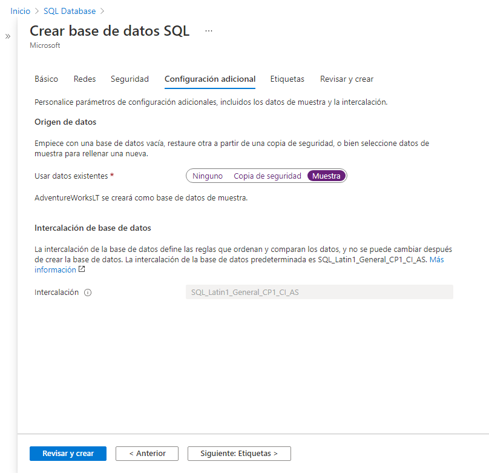

---
wts:
    title: 'Create a SQL database (5 minutes)'
    module: 'CC4IoT'
---

#06: Create a SQL database (5 min)

In this tutorial, we'll create a SQL database in Azure and then query the data in that database.

# Task 1: Create the database

In this task, we will create an SQL database based on the AdventureWorksLT sample database.

1. Sign in to the Azure portal via [**https://portal.azure.com**](https://portal.azure.com).

2. On the **All Services** blade, locate and select **SQL Databases**, and then click **+ Add, + Create, and + New**.

3. On the **Basic Data** tab, fill in this information.

     | Settings | Value |
     | --- | --- |
     | Subscription | **Use the supplied default subscription** |
     | Resource Group | **Create a new resource group** |
     | Database name | **db1** |
     | Server | Select **Create New** (a new sidebar will open on the right)|
     | Server name | **sqlserverxxxx** (must be unique) |
     | Location | **East US (US)** |
     | Authentication method | **Use SQL authentication** |
     | Server Administrator Login | **sqluser** |
     | Password | **Pa$$w0rd1234** |
     | Click | **Accept** |

    

4. On the **Networks** tab, configure the following options (leave the rest as default).

     | Configuration | Value |
     | --- | --- |
     | Connectivity method | **Public Hotspot** |
     | Allow Azure services and resources to access this server | **Yes** |
     | Add the current IP address of the client | **No** |
    
    

5. Click the **Security** tab.

     | Configuration | Value |
     | --- | --- |
     | Microsoft Defender for SQL| **Not now** |
    
6. Go to the **Additional Settings** tab. We will use the AdventureWorksLT sample database.

     | Configuration | Value |
     | --- | --- |
     | Use existing data | **Sample** |

     

7. Click **Review + Create** and then **Create** to deploy and provision the resource group, server, and database. Deployment can take 2-5 minutes.


# Task 2: Test the database.

In this task, we will configure the SQL server and run a SQL query.

1. When the deployment is complete, click Go to resource from the deployment sheet. Alternatively, find and select **Databases** and then **SQL Databases** on the **All Resources** sheet and make sure your new database has been created. You may need to **Refresh** the page.

     

2. Click the **db1** entry that represents the SQL database you created. On the db1 sheet, click **Query Editor (Preview)**.

3. Log in as **sqluser** with the password **Pa$$w0rd1234**.

4. You will not be able to log in. Please read the error carefully and make a note of the IP address that should be allowed through the firewall.

     

5. Return to the **db1** sheet and click **Overview**.

     

6. On the db1 **Overview** blade, click **Set Server Firewall** at the top center of the Overview screen.

7. Click **+ Add Client IP** (on the top menu bar) to add the IP address that the error was referring to (the fields may have been auto-filled for you; in otherwise, paste it into the IP address fields.) Be sure to **save** your changes.

     

8. Go back to your SQL database (slide the toggle bar to the left) and click **Query Editor (Preview)**. Try logging in again as **sqluser** with the password **Pa$$w0rd1234**. This time you should be able to. Please note that the implementation of the new firewall rule may take a couple of of minutes.

9. Once you have successfully logged in, the query panel appears. Type the following query in the editor panel.

     ```SQL
     SELECT TOP 20 pc.Name as CategoryName, p.name as ProductName
     FROM SalesLT.ProductCategory pc
     JOIN SalesLT.Product p
     ON pc.productcategoryid = p.productcategoryid;
     ```

     

10. Click **Run**, and then review the results of the query in the **Results** pane. The query should run successfully.

     

Congratulations!! You have created a SQL database in Azure and have successfully queried the data in that database.

**Note**: To avoid additional costs, you can remove this resource group. Browse for resource groups, click your resource group, and then click **Delete Resource Group**. Verify the name of the resource group, and then click **Delete**. Monitor **Notifications** to see how the removal is taking place.
